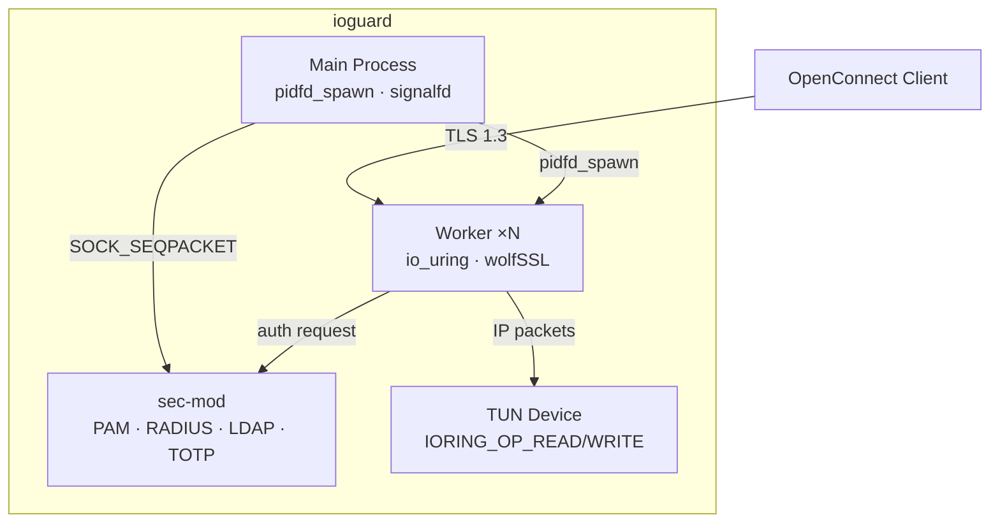

<p align="center">
  <h1 align="center">ioguard</h1>
  <p align="center">Modern OpenConnect VPN server — wolfSSL, io_uring, C23</p>
</p>

<p align="center">
  <a href="https://www.gnu.org/licenses/old-licenses/gpl-2.0.en.html"></a>
  
  
  
  <br>
  
  
  
</p>

---

Clean-room implementation of the OpenConnect VPN protocol, built from scratch in C23. Uses wolfSSL native API for TLS 1.3/DTLS, io_uring for all I/O, and a privilege-separated three-process architecture.

## Quick Start

```bash
git clone https://github.com/dantte-lp/ioguard.git && cd ioguard
cmake --preset clang-debug
cmake --build --preset clang-debug
ctest --preset clang-debug
```

## Architecture



## Key Features

- **wolfSSL native API** — TLS 1.3, DTLS 1.2/1.3, FIPS 140-3 certification path
- **io_uring for all I/O** — network, TUN, timers, signals; no libuv or epoll
- **Three-process privilege separation** — Main + sec-mod + Workers (1 per CPU)
- **OpenConnect protocol v1.2** — Cisco AnyConnect / Secure Client compatible
- **Multiple auth backends** — PAM, RADIUS, LDAP, TOTP, certificates
- **TOML static config + JSON dynamic rules** — wolfSentry IDPS integration
- **Dead Peer Detection** with DTLS fallback
- **Full compression support** — LZ4 + LZS (Cisco compatibility)
- **Prometheus metrics + structured logging** — RFC 5424 via stumpless
- **Linux-native** — kernel 6.7+, io_uring, seccomp, Landlock sandboxing

## Documentation

Full documentation is available in [`docs/`](docs/):

| # | Document | Description |
|---|---|---|
| 01 | [Architecture](docs/en/01-architecture.md) | Three-process model, data path, IPC design |
| 02 | [TLS & DTLS](docs/en/02-tls-dtls.md) | wolfSSL integration, cipher suites, FIPS mode |
| 03 | [Configuration](docs/en/03-configuration.md) | TOML config, wolfSentry JSON rules, examples |
| 04 | [Authentication](docs/en/04-authentication.md) | PAM, RADIUS, LDAP, TOTP, certificate auth |
| 05 | [VPN Protocol](docs/en/05-vpn-protocol.md) | CSTP, DTLS channel, DPD, compression |
| 06 | [Deployment](docs/en/06-deployment.md) | systemd, Podman, production hardening |
| 07 | [Security](docs/en/07-security.md) | seccomp, Landlock, wolfSentry, nftables |
| 08 | [Development](docs/en/08-development.md) | Build system, testing, sanitizers, fuzzing |
| 09 | [Monitoring](docs/en/09-monitoring.md) | Prometheus metrics, structured logging |
| 10 | [Client Compatibility](docs/en/10-client-compat.md) | OpenConnect, Cisco Secure Client, NetworkManager |
| 11 | [CLI Reference](docs/en/11-cli-reference.md) | iogctl commands, REST API |

## RFC Compliance

| RFC | Title | Status |
|---|---|---|
| RFC 8446 | TLS 1.3 | Implemented |
| RFC 9147 | DTLS 1.3 | Implemented |
| RFC 6347 | DTLS 1.2 | Implemented |
| RFC 9325 | BCP 195: Secure Use of TLS/DTLS | Implemented |
| RFC 7525 | Recommendations for Secure Use of TLS | Implemented |
| RFC 9146 | Connection Identifier for DTLS 1.2 | Implemented |

## Contributing

See [Development](docs/en/08-development.md) for the full workflow.

```bash
cmake --preset clang-debug && cmake --build --preset clang-debug
ctest --preset clang-debug    # Unit tests + sanitizers
```

## License

[GNU General Public License v2.0](LICENSE)
