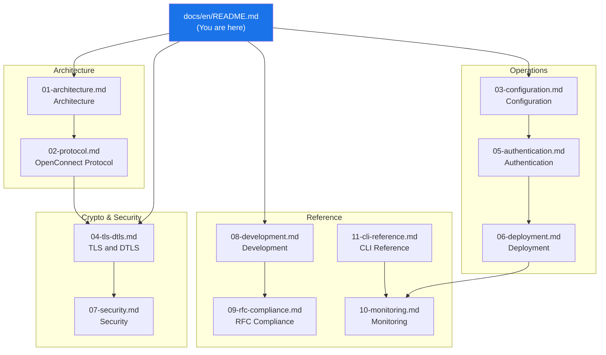

# WolfGuard Documentation

> Technical documentation for **WolfGuard** -- a C23 VPN server implementing the OpenConnect protocol with wolfSSL, io_uring, and Linux-native security.

---

## Documentation Map

---

## Table of Contents

### Architecture

| # | Document | Description |
|---|---|---|
| 01 | [**Architecture**](./01-architecture.md) | Three-process model, io_uring I/O, IPC design |
| 02 | [**OpenConnect Protocol**](./02-protocol.md) | CSTP/DTLS tunnel, packet format, handshake flow |

### Crypto & Security

| # | Document | Description |
|---|---|---|
| 04 | [**TLS and DTLS**](./04-tls-dtls.md) | wolfSSL integration, cipher suites, DTLS 1.2 |
| 07 | [**Security**](./07-security.md) | wolfSentry, seccomp, Landlock, nftables hardening |

### Operations

| # | Document | Description |
|---|---|---|
| 03 | [**Configuration**](./03-configuration.md) | TOML config reference, JSON rules, environment |
| 05 | [**Authentication**](./05-authentication.md) | PAM, RADIUS, LDAP, TOTP, sec-mod design |
| 06 | [**Deployment**](./06-deployment.md) | systemd, containers, production setup |

### Reference

| # | Document | Description |
|---|---|---|
| 08 | [**Development**](./08-development.md) | Build system, testing, C23 conventions, toolchain |
| 09 | [**RFC Compliance**](./09-rfc-compliance.md) | RFC compliance matrix, implementation notes |
| 10 | [**Monitoring**](./10-monitoring.md) | Prometheus metrics, structured logging, alerts |
| 11 | [**CLI Reference**](./11-cli-reference.md) | rwctl commands, output formats, REST API |

---

*Last updated: 2026-03-08*
