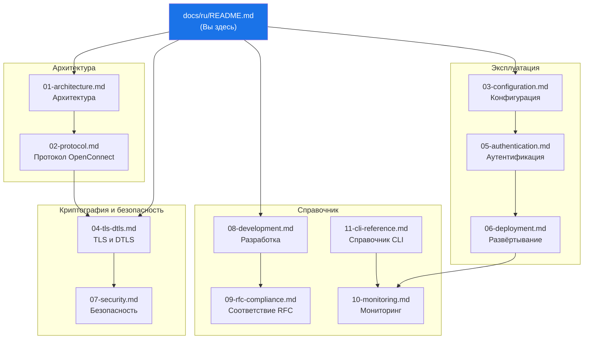

# Документация WolfGuard

> Техническая документация для **WolfGuard** -- VPN-сервер на C23, реализующий протокол OpenConnect с wolfSSL, io_uring и нативными механизмами безопасности Linux.

---

## Карта документации

---

## Содержание

### Архитектура

| # | Документ | Описание |
|---|---|---|
| 01 | [**Архитектура**](./01-architecture.md) | Трёхпроцессная модель, io_uring, проектирование IPC |
| 02 | [**Протокол OpenConnect**](./02-protocol.md) | Туннель CSTP/DTLS, формат пакетов, процесс рукопожатия |

### Криптография и безопасность

| # | Документ | Описание |
|---|---|---|
| 04 | [**TLS и DTLS**](./04-tls-dtls.md) | Интеграция wolfSSL, наборы шифров, DTLS 1.2 |
| 07 | [**Безопасность**](./07-security.md) | wolfSentry, seccomp, Landlock, усиление nftables |

### Эксплуатация

| # | Документ | Описание |
|---|---|---|
| 03 | [**Конфигурация**](./03-configuration.md) | Справочник TOML-конфигурации, JSON-правила, переменные окружения |
| 05 | [**Аутентификация**](./05-authentication.md) | PAM, RADIUS, LDAP, TOTP, архитектура sec-mod |
| 06 | [**Развёртывание**](./06-deployment.md) | systemd, контейнеры, продуктивная среда |

### Справочник

| # | Документ | Описание |
|---|---|---|
| 08 | [**Разработка**](./08-development.md) | Система сборки, тестирование, конвенции C23, инструментарий |
| 09 | [**Соответствие RFC**](./09-rfc-compliance.md) | Матрица соответствия RFC, заметки по реализации |
| 10 | [**Мониторинг**](./10-monitoring.md) | Метрики Prometheus, структурированное логирование, оповещения |
| 11 | [**Справочник CLI**](./11-cli-reference.md) | Команды iogctl, форматы вывода, REST API |

---

*Последнее обновление: 2026-03-08*
